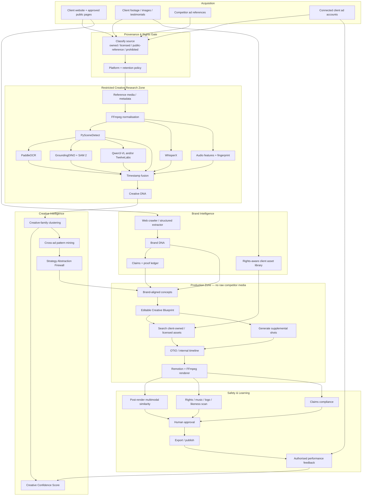
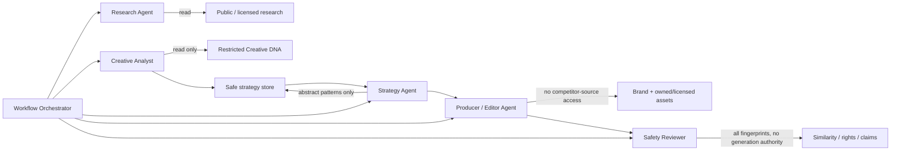
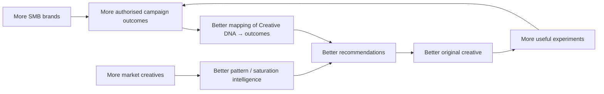

# Automated Marketing Intelligence + Creative Operating System for SMBs

## Executive summary

The strongest version of this product is **not an “AI ad generator”**. That layer is rapidly commoditising: Creatify already exposes an Ad Clone API that takes a product link plus a reference ad and reconstructs an advertisement around the reference's structure, pacing and style; Arcads' Mark similarly researches a brand and competitors before generating complete UGC ads; Foreplay exposes a large cross-platform advertising corpus to agents; and TwelveLabs can turn video into timestamped structured metadata. citeturn26search0turn8search1turn26search1turn26search3

The defensible product is instead a **marketing intelligence and creative operating system** whose proprietary layers are:

**Market evidence → Creative DNA → Brand DNA → strategy abstraction → safe creative blueprint → agentic production → performance feedback.**

That distinction matters. Competitor creative should primarily be treated as **research evidence**, not as source material to be copied. Australian copyright law protects original expression rather than underlying ideas, but infringement can arise from reproduction of a qualitatively substantial part even when that part is small; there is no percentage rule that makes copying automatically safe. Australian fair-dealing exceptions are also purpose-specific rather than a broad commercial “transformative use” defence. citeturn25search1turn25search3

I therefore recommend an architectural **information firewall**:

```text
COMPETITOR MEDIA
      │
      ▼
Restricted Analysis Environment
      │
      ├── transcript / scenes / objects / OCR
      ├── marketing functions
      ├── pacing distributions
      ├── Creative DNA
      └── market-pattern clustering
      │
      ▼
STRATEGY ABSTRACTION FIREWALL
      │
      ├── remove exact wording
      ├── remove source frames
      ├── remove music
      ├── remove actors / voices
      ├── remove logos / brand devices
      └── generalise distinctive scene combinations
      │
      ▼
Editable Brand-Specific Blueprint
      │
      ├── Brand DNA
      ├── client-owned footage
      ├── licensed stock
      └── newly generated supplemental assets
      │
      ▼
Render
      │
      ▼
Post-render similarity / rights / claims gate
```

That architecture is substantially safer than giving a generation model the original competitor video and asking it to “make this for my client”. It also creates better product differentiation: the user selects a **creative strategy supported by market evidence**, not somebody else's advertisement.

The existing open-source ecosystem is already strong enough that I would **not** build media decoding, ASR, scene detection, OCR, object segmentation, a timeline interchange format, general orchestration or a renderer from scratch. FFmpeg, WhisperX, PySceneDetect, PaddleOCR, GroundingDINO/SAM 2, Qwen3-VL, OpenTimelineIO, LangGraph/Temporal and Remotion/OpenCut cover much of the lower stack. citeturn20search0turn20search1turn20search4turn21search1turn21search3turn17search3turn19search2turn19search1turn19search0turn21search0

The important caveat is licensing. “Available on GitHub” does not equal “safe to embed in proprietary SaaS”. Firecrawl is AGPL-3.0; n8n uses a source-available Sustainable Use License rather than a conventional permissive licence; Remotion has its own commercial licence regime; FFmpeg licensing depends on how it is built; and model weights or associated datasets may have terms distinct from the code repository. Firecrawl's current GitHub repository, for example, reports AGPL-3.0 and 178,754 stars. fileciteturn5file0L2-L2 citeturn11search0turn11search4turn21search2turn27search11

My recommended first commercial wedge is:

> **Enter your business URL → confirm Brand DNA → inspect market → select a high-confidence creative strategy → choose your footage/assets → generate three original blueprints → render → pass originality/claims checks → edit → publish → learn from actual performance.**

For competitor-only research, do **not** label creatives “winning” as though you know ROAS. Meta's official Ad Library API, for example, does not expose ordinary worldwide commercial-ad performance in the way required to establish that claim; its API scope is much broader for political/social-issue advertising and for ads delivered in the UK/EU. Instead expose a **Creative Confidence Score / Market Evidence Score**, with clear evidence such as longevity, repeated variants, relaunches, adoption by multiple advertisers and cross-platform persistence. citeturn24search3

Once clients connect their own Meta, Google or TikTok advertising accounts, the system can move from proxies to true outcome learning. Google's official Ads API supports performance reporting, while TikTok's Business API includes reporting, creative reporting, video insights and in-second video performance for authorised advertising data. citeturn17search1turn17search2turn18search1turn18search3

The long-term moat is therefore **not generated video volume**. It is a dataset connecting:

\[
\text{Brand DNA} + \text{Creative DNA} + \text{audience/context} + \text{media spend} \rightarrow \text{business outcomes}
\]

At sufficient scale, that lets the system learn *which creative mechanisms work for which types of businesses* rather than merely imitate popular ads.

## Reuse landscape and build-versus-buy decisions

Star counts below are GitHub figures observed during this research on **11 September 2026** where live repository metadata was available, or the most recent GitHub-rendered figure where search indexing lagged. They should be treated as a maturity signal, not a quality metric.

| Priority | Repository | Stars | Purpose in this system | Licence | Maturity / recommendation | Integration notes |
|---|---|---:|---|---|---|---|
| **A — core** | [FFmpeg/FFmpeg](https://github.com/FFmpeg/FFmpeg) | ~61.1k | Decode, transcode, audio extraction, frame extraction, filters, probing, final encoding | Mainly LGPL; optional components GPL | Extremely mature; **use everywhere** | Hide behind an internal `MediaService`; pin build flags because licensing changes depending on enabled components. citeturn21search2 |
| **A — core** | [m-bain/whisperX](https://github.com/m-bain/whisperX) | ~22.1k | ASR, word timestamps, VAD, optional diarisation | BSD-2-Clause | Mature enough for production with QA | Excellent for word-aligned Creative DNA. Its README warns overlapping speech and diarisation remain imperfect; the diarisation model has separate terms. citeturn20search0 |
| **A — core** | [Breakthrough/PySceneDetect](https://github.com/Breakthrough/PySceneDetect) | ~4.9k | Scene/cut/transition detection | BSD-3-Clause | Mature specialised component; **use** | `ContentDetector` plus `AdaptiveDetector` gives a better sampling basis than “one frame every N seconds”; v0.7 was released May 2026. citeturn20search1 |
| **A — core** | [PaddlePaddle/PaddleOCR](https://github.com/PaddlePaddle/PaddleOCR) | ~89.2k | On-screen text, captions, price/offer OCR, bounding boxes | Apache-2.0 | Very mature; **use** | Current project supports 100+ languages and scene OCR. Store bounding boxes and time intervals, not just flattened text. citeturn20search4 |
| **A — core** | [IDEA-Research/GroundingDINO](https://github.com/IDEA-Research/GroundingDINO) | ~10.3k | Open-vocabulary object/logo/product/person detection | Apache-2.0 | Strong research-to-production component | Detect promptable concepts such as “product package”, “testimonial screenshot”, “before/after panel”, “storefront”, “price label”. citeturn21search1 |
| **A — core** | [facebookresearch/sam2](https://github.com/facebookresearch/sam2) | ~19.6k | Video segmentation and object tracking | Apache-2.0 for checkpoints/code noted by repo | Strong | Pair GroundingDINO detection with SAM 2 tracking to measure object screen-time and recurring visual motifs across scenes. citeturn21search3 |
| **A — semantic layer** | [QwenLM/Qwen3-VL](https://github.com/QwenLM/Qwen3-VL) | **19,929** | VLM interpretation: shots, actions, visual rhetoric, temporal reasoning, OCR cross-checking | Apache-2.0 repository | Strong candidate for self-hosting | The repo describes long-context/video reasoning, second-level indexing, object grounding and multilingual OCR. Verify the exact checkpoint's model-card terms separately. fileciteturn1file0L2-L2 citeturn17search3 |
| **A — timeline** | [AcademySoftwareFoundation/OpenTimelineIO](https://github.com/AcademySoftwareFoundation/OpenTimelineIO) | ~1.9k | Canonical editable timeline/interchange representation | Apache-2.0 | Mature in professional media workflows | Especially useful because OTIO represents ordering/timing and references external media instead of becoming your media store; adapters support interchange with editing ecosystems. citeturn19search2 |
| **A — agents** | [langchain-ai/langgraph](https://github.com/langchain-ai/langgraph) | ~41.4k | Stateful agent graph, checkpoints, HITL and control flow | MIT | Mature, highly applicable | Use for the *reasoning graph*, not long media computation itself. Explicit states make safety gates inspectable. citeturn19search1 |
| **A — durable jobs** | [temporalio/sdk-python](https://github.com/temporalio/sdk-python) | ~1.1k | Durable workflows for long-running ingest, GPU jobs, render retries, webhooks | MIT | Recommended once beyond MVP | Video jobs fail/retry and may run minutes; Temporal's durable async workflow model is a better operational primitive than asking an LLM agent to “wait”. citeturn19search0 |
| **A/B — web context** | [firecrawl/firecrawl](https://github.com/firecrawl/firecrawl) | **178,754** | Crawl business websites into structured/LLM-ready context | AGPL-3.0 | Highly mature, but **licence review required** | Hosted API is attractive for MVP. Avoid casually embedding modified AGPL server code in proprietary architecture without licence review. fileciteturn5file0L2-L2 |
| **B — rendering** | [remotion-dev/remotion](https://github.com/remotion-dev/remotion) | ~58.8k | Deterministic React-based motion graphics, captions, templates and rendering | **Custom Remotion licence** | Excellent technical fit | Best deterministic renderer for parametrised ads, but budget for commercial licensing. Current pricing says teams up to three can use the free licence; larger/automation use has commercial terms. citeturn21search0turn27search11 |
| **B — editor UI** | [OpenCut-app/OpenCut](https://github.com/OpenCut-app/OpenCut) | **89,165** | CapCut-like open editor; possible future agent/headless editing base | MIT | Huge traction; **watch rather than depend on its new core yet** | Live repo metadata shows 89,165 stars. Project says it is being rewritten and plans Editor API, MCP, headless mode and scripting; its own README currently points production users to the classic version. fileciteturn2file0L2-L2 citeturn22search3 |
| **B — specialised video research** | [OpenGVLab/InternVideo](https://github.com/OpenGVLab/InternVideo) | ~2.4k | Video embeddings, retrieval and richer temporal understanding | Apache-2.0 repo | Useful R&D benchmark | Useful when Creative DNA search needs a genuinely video-native embedding model. Check each released model/dataset's terms independently. citeturn22search4 |
| **C — prototype only** | [n8n-io/n8n](https://github.com/n8n-io/n8n) | ~204k | Fast workflow prototyping/connectors | Sustainable Use / fair-code | Great internally; **do not assume it can be embedded in your SaaS** | n8n's licence has restrictions around offering it commercially and particular embedded/OEM scenarios; obtain the appropriate agreement before making it product infrastructure. citeturn1search2turn11search0turn11search4 |
| **C — R&D alternative** | [DAMO-NLP-SG/VideoLLaMA3](https://github.com/DAMO-NLP-SG/VideoLLaMA3) | ~1.2k | Alternative video VLM | Apache-2.0 code | Research benchmark rather than default | Particularly instructive licensing warning: the repository says the project is Apache-2.0 **but describes its service as a non-commercial research preview subject to additional underlying-model/data terms**. citeturn22search0 |

A useful lesson from the last row is that **code licence, model-weight licence, training-data terms and hosted-service terms are four different questions**. Your dependency manifest should record all four wherever applicable. VideoLLaMA3 makes that distinction unusually visible. citeturn22search0

For your existing YouTube/Reels download pipeline, tools such as `yt-dlp` remain technically useful in R&D, but their software licences do not grant rights over the media being fetched. YouTube's Australian Terms expressly restrict reproducing/downloading/altering content except where the Service authorises it or relevant permission exists, and prohibit automated access except specified cases. That means a production architecture should be **rights-first**, not “anything technically downloadable is ingestible”. citeturn24search4

**Commercial services worth evaluating**

| Priority | Service | Buy instead of build | Why it is relevant | Caveat / recommended use |
|---|---|---|---|---|
| **A** | [Foreplay](https://www.foreplay.co/) | Competitor-ad corpus/discovery | Foreplay says its MCP exposes 200M+ ads across Facebook, Instagram, TikTok, YouTube and LinkedIn with creative, copy, CTA, landing page, activity status and observed run duration. citeturn26search1 | Evaluate contractual rights for automated analysis, retention, embeddings and derived data. Treat “long-running = profitable” as a useful proxy, not proof of ROAS. |
| **A** | [TwelveLabs](https://www.twelvelabs.io/) | Video semantic indexing/understanding | Its current platform can segment videos into timestamped structured data with user-defined segment types and custom fields; this maps unusually well to Creative DNA extraction. citeturn26search3 | Strong accelerator while building the product; later compare cost/latency/privacy against self-hosted Qwen/InternVideo. |
| **A/B** | [fal](https://fal.ai/) | Generative-video model gateway | fal exposes multiple image/video generation models behind APIs, reducing dependency on any single generation vendor. citeturn18search2 | Put your own `VideoGenerationProvider` abstraction in front of it; never let a vendor-specific request format leak into Blueprint schema. |
| **B — benchmark** | [Creatify](https://creatify.ai/) | Reference-ad → regenerated-ad pipeline | Its Ad Clone API accepts product/link data plus reference video and returns generated output; official docs explicitly describe analysing reference structure, pacing and style. citeturn26search0 | Excellent competitive benchmark. Your differentiation should be stronger strategy abstraction, provenance and originality checks rather than “clone”. |
| **B — benchmark** | [Arcads Mark](https://mark.arcads.ai/) | Research + UGC ad generation | Arcads says Mark researches product/audience/competitors and can use competitor ads as strategic reference for hook/angle/pacing before building an original brand version. citeturn8search1 | Confirms that automated competitor-informed generation is no longer enough as a moat. |
| **B — benchmark / customer analytics** | [Motion](https://motionapp.com/) | Creative performance analytics | Motion's current tooling includes creative analysis and video drop-off workflows; its MCP documentation also describes competitor creative-strategy analysis. citeturn26search2turn26search5 | Benchmark its analytics UX. Your advantage should be Creative DNA → production → feedback in one system. |
| **A for client-owned results** | Meta / Google Ads / TikTok Business APIs | Authorised first-party campaign results | Google provides account performance reporting; TikTok Business API documents creative reporting and in-second video performance. citeturn17search2turn18search3 | This is the source of **actual outcome labels**; keep it clearly separate from public competitor proxies. |

The platform-discovery situation is uneven. Meta's official Ad Library API supports worldwide political/social-issue history and all ad types delivered in the UK/EU during a limited historical window; Meta tells users to use Ad Library itself for all currently running ads. Google's Ads Transparency Centre is a searchable repository covering ads served on Search, Display, Gmail and YouTube and supports advertiser/site, date and location searching. citeturn24search3turn27search0

For that reason, a pragmatic MVP should use **official interfaces where genuinely available, a contractually permitted commercial corpus such as Foreplay where justified, and links/metadata rather than uncontrolled copying of third-party media**. Do not make a home-grown cross-platform scraper the commercial product's central dependency.

## Creative DNA, Brand DNA and editable blueprint schemas

The data architecture should distinguish **observations** from **interpretations**. “OCR detected `$49` between 02.1 and 04.8 seconds” is evidence; “this is a low-friction price-anchor scene” is an interpretation. Keeping both makes the system auditable and lets newer models reinterpret old videos without reprocessing every pixel.

A second distinction is equally important: **competitor-source features versus generation-safe features**. The generation agent should not receive exact competitor dialogue, frame embeddings, audio files or screenshots when it does not need them. It should receive higher-order concepts such as “open with a counter-intuitive cost-saving claim” or “show concrete proof before explaining mechanism”.

### Creative DNA

| Group | Recommended fields | Example | Why it matters |
|---|---|---|---|
| **Identity / provenance** | `creative_id`, `advertiser_id`, `platform`, `source_uri`, `capture_method`, `observed_first`, `observed_last`, `market`, `rights_basis`, `retention_policy` | `platform=meta`, `rights_basis=analysis_only` | Provenance becomes mandatory when competitor material and client-owned assets coexist. Meta creative access itself is subject to platform terms. citeturn24search3 |
| **Technical media** | `duration_ms`, `fps`, `width`, `height`, `aspect_ratio`, `codec`, `language`, `audio_present`, `frame_rate_mode` | `duration=27.42s`, `aspect=9:16` | Makes timing and rendering calculations deterministic; FFmpeg/ffprobe are ideal primitives. citeturn21search2 |
| **Transcript evidence** | word-level `{text,start,end,confidence,speaker}`, sentence spans, pauses, speech rate | `"Most agencies..." 0.33–1.54` | Word-level alignment lets you connect language to cuts, overlays and retention points; WhisperX was designed for this. citeturn20search0 |
| **Scenes / shots** | `scene_id`, start/end, scene function, setting, shot size/type, camera movement, composition, speaker type, activity | `function=proof`, `shot=screen-recording` | Scene-aware sampling avoids treating unrelated frames as a flat image set; PySceneDetect exposes scene boundaries. citeturn20search1 |
| **Messaging** | `hook`, `problem`, `pain`, `desire`, `promise`, `mechanism`, `offer`, `proof`, `objections`, `CTA`, `urgency`, `audience`, `claims[]` | `hook_type=cost_of_inaction` | This is the strategy layer the product ultimately searches and clusters. |
| **Claims** | exact claim, type, strength, qualifier, evidence present, evidence type, risk class | `"cuts bills by 40%"`, `quantified_claim=true` | Lets downstream Brand DNA/claims checking prevent AI from inventing evidence. |
| **OCR timeline** | text, start/end, bounding box, confidence, style class, semantic role | `"$49 today"` centre-bottom | PaddleOCR supports scene OCR and coordinate-rich extraction. citeturn20search4 |
| **Objects / motifs** | entity label, first/last appearance, track ID, screen coverage, salience, repetition | product bottle visible 41% of ad | GroundingDINO plus SAM 2 can detect and track open-vocabulary objects through video. citeturn21search1turn21search3 |
| **People** | `speaker_type`, `role`, `framing`, `direct_to_camera`, `face_present`; do **not** infer sensitive attributes unnecessarily | `founder/expert`, close-up | “Founder-led versus customer-led” is useful Creative DNA; demographic profiling of identifiable people usually is not required. |
| **Audio** | speech/music/SFX intervals, music mood/energy, approximate BPM, loudness curve, silence, licensed/fingerprint status | `music.energy=rising` | Separate stylistic function from copyrighted recording identity. The generator should be told “upbeat sparse percussion”, not handed the source song. |
| **Pacing** | cuts/minute, median shot length, p25/p75 shot length, time-to-first-claim, time-to-product, time-to-proof, time-to-CTA, text-change rate | CTA at `0.78 × duration` | Gives you structural comparison without requiring identical timing. |
| **Emotional design** | desired emotion, tension curve, curiosity, empathy, aspiration, authority, humour, urgency | `{0–3s: curiosity, 3–12s: concern}` | Better represented as a time series than one overall label. |
| **Creative family** | family centroid, strategy cluster, variant IDs, changed dimensions, shared abstractions | 18 variants of same problem/demo concept | Needed for market-evidence scoring; one ad is weak evidence, repeated creative families are stronger evidence. |
| **Performance evidence** | `active_days`, `relaunches`, `variants`, `distinct_advertisers`, cross-platform observations; separate `authorised_metrics` | longevity 92 days | Public evidence and customer-owned performance must remain separate so proxy signals are not presented as measured ROAS. Meta's public library data has material scope limits. citeturn24search3 |
| **Embeddings/fingerprints** | transcript semantic embedding, visual embeddings per shot, audio fingerprint, OCR/layout embedding, sequence representation | internal only | Required for search, family clustering and originality gates. Keep competitor fingerprints in a restricted index. |
| **IP / safety** | third-party logos, source-media hashes, music match, face/voice consent status, similarity scores, prohibited elements | `third_party_music=true` | Turns copyright safety into a data constraint rather than a final prompt. |
| **Extraction lineage** | schema version, model/version per field, confidence, timestamp, source evidence IDs | `vlm=qwen3-vl/...` | Critical for reproducibility and upgrading extraction models. |

A scene should be sufficiently rich that an ad can be reconstructed conceptually without retaining the original visual expression:

```json
{
  "scene_id": "s03",
  "start_ms": 5800,
  "end_ms": 9400,
  "marketing_function": "proof",
  "message_function": "demonstrate_mechanism",
  "speaker_type": "founder",
  "shot_type": "medium_closeup_to_screen_recording",
  "camera_motion": "static",
  "objects": ["phone", "analytics_dashboard"],
  "ocr": [
    {
      "text": "42% more enquiries",
      "start_ms": 6410,
      "end_ms": 9030,
      "semantic_role": "quantified_proof"
    }
  ],
  "audio": {
    "speech_rate_wpm": 168,
    "music_energy": 0.42
  },
  "interpretation": {
    "emotion": ["credibility", "relief"],
    "proof_type": "demonstration_plus_metric"
  }
}
```

That is dramatically more useful than a generic VLM summary such as “a man shows a phone and talks about getting more customers”. TwelveLabs' custom timestamped segmentation model and Qwen3-VL's video/timestamp capabilities show that structured temporal extraction is technically feasible today. citeturn26search3turn17search3

### Brand DNA

| Group | Recommended fields | Product behaviour |
|---|---|---|
| **Identity** | legal/trading name, domains, locations, languages, markets | Ground everything else in a canonical organisation record. |
| **Products/offers** | offer ID, product/service, price model, margin band, availability, priority | Prevent an agent from advertising an obsolete or low-priority service. |
| **Audience** | ICPs, jobs-to-be-done, pains, desired outcomes, buying stage, objections | Creative recommendations become segment-specific rather than “one brand voice”. |
| **Positioning** | category, differentiators, value propositions, alternatives, reasons-to-believe | Used to adapt a market pattern instead of substituting a logo. |
| **Brand voice** | tone dimensions, sentence style, preferred vocabulary, forbidden vocabulary, humour boundaries, example copy | Converts vague “make it sound like us” into machine-readable constraints. |
| **Claims ledger** | claim, allowed wording, evidence ID, evidence strength, expiry/review date, jurisdictions, required qualifier | **One of the highest-value fields.** Only substantiated claims should reach production. |
| **Proof library** | testimonials, reviews, certifications, case studies, metrics, provenance, consent | Lets an ad generator choose legitimate proof rather than hallucinate it. |
| **Visual system** | logos, variants, fonts, colours, layouts, safe areas, motion rules, prohibited treatments | Feeds deterministic rendering. |
| **Asset library** | asset ID, media type, subjects, timestamps, quality, usage rights, talent releases, geographic/term restrictions | Every client clip should have machine-readable rights metadata. |
| **People / likeness** | client staff/talent IDs, permitted uses, voice/face-generation consent, expiry | Necessary before avatarisation, voice cloning or synthetic extensions. |
| **Content pillars** | education, founder POV, customer proof, demonstration, community, product | Powers organic as well as paid workflows. |
| **Channel rules** | platform, format, duration range, aspect ratio, caption style, CTA conventions | Rendering targets become constraints rather than prompts. |
| **Compliance** | industry, regulated category, prohibited claims, disclaimer templates, review requirement | High-risk industries should automatically invoke additional review. |
| **Goals / funnel** | awareness, consideration, leads, purchase; primary CTA; conversion event | Creative scoring should be objective-specific. |
| **Competitive exclusions** | competitor trademarks/names/phrases/assets never to use | Makes “research them but never mention or reproduce them” explicit. |
| **Performance memory** | campaign/creative results, audience, spend, placement, dates, attribution model | Becomes supervised outcome data when connected through authorised ad APIs. Google Ads officially supports account reporting. citeturn17search2 |

The Brand DNA extraction should initially crawl the website and selected public business pages, but present uncertain facts to the owner for confirmation. A website crawler such as Firecrawl can accelerate this, although its current AGPL licence makes a hosted API or carefully reviewed deployment more attractive than blindly incorporating its server into proprietary code. fileciteturn5file0L2-L2

The third schema is a **Creative Blueprint**. It should be editable independently from both the source video and final MP4, ideally serialisable into OpenTimelineIO or convertible to it. OpenTimelineIO is specifically an interchange format/API for editorial timing and references to external media rather than a media container, and its maintainers describe the core API as mature and stable. citeturn19search2

```json
{
  "blueprint_id": "bp_123",
  "strategy": {
    "hook_family": "cost_of_inaction",
    "narrative": ["hook", "problem", "mechanism", "proof", "cta"],
    "source_strategy_refs": ["family_82"],
    "abstraction_level": "market_pattern"
  },
  "shots": [
    {
      "start_ms": 0,
      "duration_ms": 2400,
      "function": "hook",
      "voiceover": "Most local businesses lose enquiries before they even answer the phone.",
      "visual_brief": "Owner at counter notices unanswered enquiry notification",
      "asset_requirement": {
        "source": ["client_owned", "generated"],
        "avoid": ["competitor_assets", "third_party_faces"]
      },
      "overlay": {
        "copy": "How many enquiries are slipping away?",
        "style_token": "brand.caption.primary"
      }
    }
  ],
  "safety": {
    "must_pass_claim_check": true,
    "must_pass_similarity_scan": true,
    "reference_media_available_to_generator": false
  }
}
```

The final field is deliberate: **the generation/editing agent ordinarily should not be allowed to retrieve the competitor source video after abstraction**.

## Ingestion architecture, video understanding stack and agent orchestration

The architecture should have two separate security zones: a **research zone**, permitted to inspect reference creative according to its rights/provenance policy, and a **production zone**, which only sees safe abstractions plus client/licensed/generated assets.



The low-level media pipeline should be **deterministic before it is generative**. FFmpeg/ffprobe normalises and interrogates media; PySceneDetect establishes candidate boundaries; WhisperX aligns speech to time; PaddleOCR extracts spatially located text; GroundingDINO identifies open-vocabulary entities; SAM 2 propagates those entities through frames; then the VLM reasons over selected clips/keyframes plus the fused transcript/OCR/object context. citeturn21search2turn20search1turn20search0turn20search4turn21search1turn21search3

That order is more efficient than sending every frame to a frontier multimodal model. Qwen3-VL's repository supports video understanding and timestamp-grounded temporal processing, while TwelveLabs provides a hosted alternative that can directly produce custom structured timestamped segments. citeturn17search3turn26search3

A practical sampling algorithm would be:

```python
scenes = detect_scenes(video)

for scene in scenes:
    frames = [
        scene.first_stable_frame,
        scene.semantic_keyframe,
        scene.last_stable_frame,
    ]

    # Add frames where another signal says something changed.
    frames += frames_at_large_ocr_change(scene)
    frames += frames_at_new_object_entry(scene)
    frames += frames_at_speaker_change(scene)
    frames += frames_at_motion_peak(scene)

    frames = deduplicate_perceptually(frames)

    result = vlm_analyse(
        clip=scene.low_res_clip,
        keyframes=frames,
        transcript=words_in(scene),
        ocr=ocr_in(scene),
        tracked_objects=objects_in(scene),
        requested_schema=CreativeSceneDNA
    )
```

This should substantially reduce VLM tokens while retaining the moments most likely to carry marketing meaning.

**Recommended stack by layer**

| Layer | Default open stack | Buy/managed alternative | Recommendation |
|---|---|---|---|
| Website intelligence | Firecrawl-hosted or your own crawler + extraction schema | Firecrawl API | Start managed; revisit because of AGPL implications. fileciteturn5file0L2-L2 |
| Media normalisation | FFmpeg / ffprobe | Cloud transcoding if scale demands | Do not reinvent. citeturn21search2 |
| Scene detection | PySceneDetect | TwelveLabs segmentation | Local PySceneDetect first. citeturn20search1turn26search3 |
| Speech | WhisperX | managed ASR if operationally easier | WhisperX is particularly valuable because Creative DNA needs timings, not just text. citeturn20search0 |
| OCR | PaddleOCR | cloud vision APIs | Default local. citeturn20search4 |
| Open-vocabulary objects | GroundingDINO | VLM | Use detector for repeatable quantitative attributes. citeturn21search1 |
| Tracking / motif persistence | SAM 2 | hosted video analysis | Pair with GroundingDINO. citeturn21search3 |
| Semantic video reasoning | Qwen3-VL | TwelveLabs | Run a benchmark on your actual 100–500-ad dataset before committing. citeturn17search3turn26search3 |
| Video embeddings | InternVideo / multimodal embeddings | TwelveLabs | Buy initially if semantic video search is strategically important. citeturn22search4turn26search3 |
| Creative DB | Postgres + object store + vector extension/database | managed Postgres/vector DB | Keep structured facts relational; blobs in object store; vectors as indexes, not source of truth. |
| Agent state machine | LangGraph | managed agent platform | Good explicit safety/control graph. citeturn19search1 |
| Durable computation | Temporal | managed Temporal | Add early if renders/GPU jobs/webhooks become operationally painful. citeturn19search0 |
| Editable timeline | OpenTimelineIO + internal Blueprint JSON | — | Use OTIO as interchange boundary. citeturn19search2 |
| Deterministic rendering | Remotion + FFmpeg | hosted render infrastructure | Very strong fit; license commercially as necessary. citeturn21search0turn27search11 |
| Full editor UI | custom focused editor, borrow concepts from OpenCut | — | Do **not** build CapCut in MVP. OpenCut itself is in a major rewrite. citeturn22search3 |
| Generative supplemental shots | provider adapter | fal/model APIs | Build a provider abstraction from day one. citeturn18search2 |

For the agent layer, I would avoid one giant “marketing super-agent”. Use a supervisor with small, typed tool contracts and explicit permissions.



A concrete internal tool surface could look like:

```typescript
ingest_brand({
  url,
  publicProfiles,
  locale
}) -> BrandId

discover_competitors({
  brandId,
  geography,
  category,
  mode: "direct" | "aspirational" | "content"
}) -> Competitor[]

search_ad_references({
  competitorIds,
  platforms,
  dateRange,
  mediaTypes,
  rightsPolicy
}) -> AdReference[]

analyse_video({
  assetId,
  schemaVersion,
  analyzers: ["asr", "scene", "ocr", "objects", "audio", "vlm"]
}) -> CreativeDNAId

cluster_creatives({
  creativeIds,
  dimensions: ["message", "structure", "visual", "offer"]
}) -> CreativeFamily[]

score_creative_family({
  familyId,
  marketContext
}) -> CreativeConfidenceReport

abstract_strategy({
  familyIds,
  maxSourceSpecificity: "strategy_only"
}) -> SafeStrategy

generate_blueprints({
  brandId,
  safeStrategyId,
  objective,
  duration,
  count
}) -> Blueprint[]

find_client_assets({
  brandId,
  requirements,
  rightsRequired: true
}) -> AssetMatch[]

generate_supplemental_shot({
  brandId,
  shotBrief,
  provider,
  prohibitedReferences
}) -> AssetId

check_claims({
  brandId,
  script
}) -> ClaimSafetyReport

compose_timeline({
  blueprintId,
  assetAssignments
}) -> TimelineId

render({
  timelineId,
  aspectRatio,
  resolution
}) -> RenderId

similarity_scan({
  renderId,
  restrictedReferenceSetId
}) -> SimilarityReport

rights_scan({
  renderId,
  assetIds
}) -> RightsReport

request_human_approval({
  renderId,
  safetyReports
}) -> ApprovalDecision
```

The permissions are more important than the model choice. `ProducerAgent` should not possess `get_reference_frames()` or `get_reference_audio()`. `SafetyReviewer` should be able to compare against originals but **should not be able to generate media**. LangGraph's explicit stateful graph and human-in-the-loop mechanisms are a good fit for enforcing these boundaries. citeturn19search1

## Creative Confidence, originality and safety algorithms

### Creative Confidence Score

The purpose of the score is to estimate:

> **“How much observable market evidence supports testing this creative strategy?”**

It should **not** mean:

> “We know this advertisement was profitable.”

That distinction is necessary because public transparency data does not expose ordinary worldwide competitor ROAS/CPA in a uniform way. Meta's API, for example, exposes special spend/impression data primarily for social/political ads and additional data for the UK/EU, rather than universal commercial performance. citeturn24search3

Foreplay explicitly promotes longevity as a useful signal for successful creative, but that remains a vendor heuristic rather than proof of an advertiser's unit economics. citeturn26search1

For each creative family \(f\), normalise features against **the same country × vertical × channel × approximate format** rather than globally:

\[
L_f=\operatorname{clip}\left(
\frac{\log(1+\text{activeDays}_f)}
{\log(1+D_{95})},0,1
\right)
\]

\[
V_f=\operatorname{clip}
\left(
\frac{\log(1+\text{variantCount}_f)}
{\log(1+V_{95})},0,1
\right)
\]

\[
A_f=\frac{\text{distinct advertisers using pattern}}
{\text{relevant advertisers observed}}
\]

\[
X_f=\frac{\sum_p w_p I(\text{pattern seen on platform }p)}
{\sum_p w_p}
\]

Then begin with an interpretable score:

\[
\boxed{
C_{\text{market}}=
100Q\left(
0.28L+
0.18V+
0.16R+
0.14A+
0.10X+
0.08F+
0.06O
\right)
}
\]

where:

| Variable | Meaning |
|---|---|
| \(L\) | longevity percentile |
| \(V\) | count/diversity of related creative variants |
| \(R\) | relaunch or persistence frequency |
| \(A\) | adoption by distinct advertisers |
| \(X\) | cross-platform recurrence |
| \(F\) | recency/freshness |
| \(O\) | optional organic resonance, when data is legitimate and comparable |
| \(Q\) | evidence-quality factor from 0–1 based on completeness, provenance and sampling confidence |

The exact weights above are **initial product heuristics, not empirically established constants**. The point is to start with something interpretable and then learn the weights from actual customer outcomes.

Saturation should be shown separately rather than blindly added to confidence:

\[
\text{OpportunityScore}
=
C_{\text{market}}
\times
(1-\lambda \cdot \text{Saturation})
\times
\text{BrandFit}
\]

A strategy can therefore be **high confidence but low opportunity** if every competitor already executes it identically.

Once authorised campaign results exist, replace heuristic weights with hierarchical/Bayesian estimates. For example:

\[
\theta_f \sim \mathcal N(\mu_{\text{vertical}},\tau^2)
\]

\[
y_i =
\theta_f +
\beta^\top X_i +
\epsilon_i
\]

where \(y_i\) could be a normalised CPA, conversion rate, qualified-lead rate or revenue metric and \(X_i\) controls for spend, audience, placement, offer, seasonality and brand. Google Ads provides formal performance reporting, and TikTok documents advertiser reporting including creative/video performance, making such a customer-owned learning loop feasible. citeturn17search2turn18search3

The UI should expose the evidence:

```text
CREATIVE STRATEGY
“Specific pain → quick demonstration → proof → low-friction CTA”

Market Evidence: 86 / 100
Confidence: High

Why:
  Observed across 11 advertisers
  37 related variants
  Median observed persistence: 74 days
  8 relaunch events
  Seen on 3 platforms

Not known:
  Competitors' ROAS
  Competitors' CPA
  Actual conversion rate
```

That presentation is both more honest and more useful.

### Similarity and non-copying engine

There should be **no single “copyright similarity percentage”**. Australian guidance explicitly says there is no percentage rule, that substantiality can be qualitative, and that even a small but distinctive part can matter. U.S. fair-use guidance likewise states there is no fixed number of words, percentage or amount that guarantees fair use. citeturn25search3turn25search0turn25search2

Your thresholds should therefore be labelled **engineering review thresholds**, not legal safe harbours.

Compute separate channels:

\[
S =
\{
S_\text{lexical},
S_\text{semantic},
S_\text{visual},
S_\text{sequence},
S_\text{layout},
S_\text{audio},
S_\text{identity}
\}
\]

**Lexical similarity**

Use several detectors rather than one embedding:

\[
S_\text{lexical}
=
\max(
\text{nGramJaccard},
\text{normalisedLCS},
\text{rarePhraseOverlap}
)
\]

Strip unavoidable product/category terminology first. Give **rare or slogan-like phrase matches much higher weight** than generic phrases such as “book today”.

**Semantic similarity**

Embed source and regenerated hooks, body propositions and CTA separately:

\[
S_\text{semantic}
=
0.45S_\text{hook}+
0.35S_\text{body}+
0.20S_\text{CTA}
\]

High conceptual similarity alone should not cause a block—copyright generally does not protect mere ideas—but semantic similarity combined with distinctive expression or structure increases risk. Australia's Attorney-General expressly distinguishes ideas/information from their original expression. citeturn25search1

**Visual similarity**

For source shots \(r_i\) and generated shots \(g_j\):

\[
M_{ij}=\cos(E_v(r_i),E_v(g_j))
\]

Measure:

\[
S_\text{visual-nearest}
=
\frac{1}{|G|}
\sum_j \max_i M_{ij}
\]

and also detect exact/near-exact images with perceptual hashes. An exact or near-exact third-party footage match should generally be a **hard stop**, not merely part of a weighted score.

**Temporal/structural similarity**

Represent scenes as tokens:

```text
HOOK_CREATOR_CLOSEUP
PROBLEM_BROLL
DEMO_SCREEN
TESTIMONIAL
OFFER_TEXT
CTA_CREATOR_CLOSEUP
```

Calculate normalised edit distance, and separately apply Dynamic Time Warping to shot-duration vectors:

\[
S_\text{sequence}
=
1-\frac{\operatorname{EditDistance}(A,B)}
{\max(|A|,|B|)}
\]

\[
S_\text{pacing}
=
e^{-\alpha \cdot DTW(d_A,d_B)}
\]

Structure alone should have relatively permissive thresholds because high-level storytelling structures are often generic. The danger increases when **structure + exact timing + wording + visual composition** all align.

**Audio**

Use fingerprints for exact/near-exact recordings. Source competitor music should never be “style transferred” by simply retaining the recording. A recognised third-party recording without a valid licence should trigger a hard block.

**Layout/OCR**

Compare:

- exact overlay wording;
- screen-relative bounding boxes;
- typography role;
- sequence of overlay appearances;
- distinctive arrangement.

This catches an otherwise easy failure mode where an LLM rewrites a script but recreates the same titles in the same locations at the same moments.

A composite review score can be useful operationally:

\[
R =
0.22S_\text{semantic}
+0.18S_\text{lexical}
+0.20S_\text{visual}
+0.15S_\text{sequence}
+0.10S_\text{pacing}
+0.08S_\text{layout}
+0.07S_\text{audio}
\]

but **hard rules override \(R\)**.

A reasonable *starting* engineering policy for calibration—not a legal rule—would be:

```python
def assess_originality(candidate, references):
    features = multimodal_similarity(candidate, references)

    # Absolute gates
    if features.exact_third_party_video_match:
        return BLOCK("third-party footage reuse")

    if features.unlicensed_audio_fingerprint_match:
        return BLOCK("unlicensed source audio")

    if features.unauthorised_face_or_voice_replication:
        return BLOCK("likeness/voice consent missing")

    if features.competitor_logo_or_watermark_retained:
        return BLOCK("competitor identity retained")

    if features.distinctive_slogan_match:
        return BLOCK("source-specific expression retained")

    # Multi-signal gate: arbitrary seed values for calibration.
    high_channels = sum([
        features.lexical > 0.80,
        features.visual > 0.80,
        features.sequence > 0.80,
        features.layout > 0.80,
    ])

    risk = weighted_copy_risk(features)

    if high_channels >= 2:
        return REAUTHOR("multiple source-specific dimensions too similar")

    if risk >= 0.68:
        return REAUTHOR("high composite similarity")

    if risk >= 0.55:
        return HUMAN_REVIEW("borderline similarity")

    return PASS()
```

The numeric values should be deliberately called **seed thresholds**. Calibrate them against expert judgements; never tell a customer “67% similar is legal but 69% is illegal”. Australian infringement analysis considers substantiality, copying/access and objective similarity, not a SaaS cosine score. citeturn25search3

### Strategy-abstraction transformation

The strongest safety algorithm acts *before* generation:

```python
def abstract_reference_family(creatives):
    patterns = infer_cross_creative_patterns(creatives)

    safe = SafeStrategy()

    # Keep generic marketing ideas.
    safe.audience_problem = generalise(patterns.problem)
    safe.hook_mechanism = classify_hook(patterns.hooks)
    safe.narrative_functions = generalise_scene_functions(patterns.scenes)
    safe.proof_mechanism = classify_proof(patterns.proof)
    safe.offer_mechanism = classify_offer(patterns.offers)
    safe.pacing_band = bucket_pacing(patterns.pacing)

    # Explicitly throw away source-specific expression.
    safe.exact_script = None
    safe.source_frames = None
    safe.source_audio = None
    safe.actor_identity = None
    safe.competitor_logos = None
    safe.distinctive_graphics = None
    safe.exact_shot_durations = None

    # Reduce risk further by using consensus across multiple ads.
    safe = retain_only_features_seen_across_multiple_independent_sources(safe)

    return safe
```

That final step is powerful. A feature observed independently across twelve brands is more likely to represent a **market convention or strategy** than the distinctive expressive contribution of one advertisement. It is not a legal test, but it is an excellent product-level abstraction heuristic.

You can formalise this with **source entropy**. Suppose a pattern \(p\) occurs across advertisers \(a\):

\[
H(p)=
-\sum_a P(a|p)\log P(a|p)
\]

High-entropy patterns—distributed across many independent advertisers—are safer candidates for strategy-level inspiration. Low-entropy patterns dominated by one competitor should be generalised more aggressively or excluded.

### Claim and rights safety

Generation should also have hard constraints independent of competitor similarity:

```python
def production_preflight(blueprint, brand):
    for claim in extract_claims(blueprint):
        evidence = brand.claims_ledger.match(claim)

        if evidence is None:
            block(claim, "No substantiation in Brand DNA")

        if evidence.requires_qualifier:
            require_overlay(evidence.qualifier)

    for asset in blueprint.assets:
        if not asset.rights.allows("commercial_advertising"):
            block(asset, "Rights do not cover proposed use")

        if asset.contains_person and not asset.likeness_release.valid:
            block(asset, "Talent consent missing")

    for generated_person in blueprint.synthetic_people:
        require_documented_generation_policy(generated_person)
```

This turns Brand DNA into a genuine **marketing governance layer**, not merely a tone-of-voice prompt.

## MVP experience, rollout timeline and validation experiments

The best MVP should feel considerably simpler than the underlying infrastructure.

### Customer product flow

**Onboarding**

```text
Enter: acmeplumbing.com.au
               ↓
System researches:
website → services → locations → public reviews → visible proof → brand style
               ↓
“Here is what we think your business is.”
               ↓
Owner confirms/corrects Brand DNA
```

The customer should verify critical elements—offer, service areas, prices, proof and quantitative claims—rather than letting web extraction silently become truth.

**Market intelligence**

```text
Your market
────────────────────────────────────────
19 relevant competitors found
347 observable creatives analysed
43 creative families
────────────────────────────────────────

Common strategies:
Problem → Demo → CTA                    92 evidence
Founder advice → Proof → Offer          84
Customer story → Transformation → CTA   79

Potential whitespace:
Myth-busting educational hook           71 opportunity
Before/after process walkthrough        68 opportunity
```

**Strategy inspection**

Instead of displaying “Copy this competitor”, show:

```text
STRATEGY: Cost-of-inaction → demonstration → proof

Why we're recommending it
• observed across multiple independent advertisers
• persistent creative families
• strong cross-platform recurrence

Typical structure
0–15%    attention / problem
15–45%   mechanism or demonstration
45–75%   proof
75–100%  offer / CTA

Do not copy
• competitor wording
• actors
• footage
• music
• distinctive visual treatment
```

**Production**

```text
What do we have?

✓ 14 client videos
✓ 23 product / workplace photos
✓ founder available on camera
✓ 7 approved testimonials
✓ logo + fonts + colours

Missing for this concept:
○ close-up service demonstration
○ opening reaction shot

[Use existing assets] [Generate supplemental shots]
```

Then generate **three materially different blueprints**, not three tiny variants:

```text
A — Founder-led authority
B — Customer-problem narrative
C — Demonstration-first
```

The user edits script, shot choice, overlay, duration, CTA and asset assignment in a purpose-built timeline rather than a full professional NLE.

**Safety view**

```text
Originality                   PASS
Third-party footage           NONE
Unlicensed music              NONE
Competitor logo/text          NONE
Source similarity             LOW
Claims                        5 checked / 5 substantiated
Talent permissions            VALID

[Approve & render final]
```

That transparency itself can become a selling point for agencies.

### Suggested implementation timeline

| Phase | Product outcome | Main engineering |
|---|---|---|
| **Weeks 1–3** | URL → reviewed Brand DNA | Website ingest, Brand schema, claim/proof extraction, manual correction UX |
| **Weeks 2–5** | Video → Creative DNA | Existing downloader where authorised + FFmpeg + PySceneDetect + WhisperX + OCR + VLM fusion |
| **Weeks 4–7** | Competitor intelligence dashboard | Family clustering, search, evidence provenance, initial Confidence Score |
| **Weeks 6–9** | Strategy → editable Blueprint | Abstraction firewall, Blueprint schema, client-asset search |
| **Weeks 8–11** | Blueprint → rendered ad | Remotion/FFmpeg, captions, templates, generated-shot provider adapter |
| **Weeks 9–12** | Safety gate | text/visual/audio/sequence similarity, claims ledger, provenance, human review |
| **Weeks 12–16** | Closed SMB pilot | 5–20 businesses, real production use, collect editing behaviour and subjective ratings |
| **Months 4–6** | Outcome loop | Meta/Google/TikTok client-account integrations, creative-to-campaign lineage, performance attribution |
| **After product fit** | Autonomous weekly creative OS | competitor changes, recommendations, experiment queue, production, approvals, publishing |

That is deliberately narrower than building an entire autonomous marketing department. The first objective is proving:

\[
\text{research}
\rightarrow
\text{better idea selection}
\rightarrow
\text{faster production}
\rightarrow
\text{usable original creative}
\]

before adding every possible publishing, CRM and attribution integration.

### Experiments for validating “useful but not copying”

You need an **originality evaluation dataset** before launching one-click remix.

Create perhaps 500–2,000 tuples:

```text
(reference ad,
 abstract blueprint,
 generated candidate,
 expert similarity labels)
```

Include intentionally difficult negatives:

- same script with synonyms;
- same frames with crops;
- same edit sequence but new actors;
- same distinctive opening joke;
- same soundtrack with pitch shift;
- same captions/layout with rewritten wording;
- generic category structure with completely different execution;
- independently created ads that happen to share common conventions.

Then run the following experiments.

| Experiment | Test | Success metric |
|---|---|---|
| **Reference-access ablation** | Generation model sees full competitor ad vs transcript vs detailed DNA vs strategy-only abstraction | Strategy-only version retains marketing utility while sharply reducing multimodal similarity |
| **Single-source vs multi-source abstraction** | Generate from one competitor versus consensus patterns across ≥5 advertisers | Multi-source candidates should score lower on source-specific similarity without losing reviewer-rated relevance |
| **Human copying judgement** | Blind experts see reference/candidate pairs | Low “looks copied from X” rate |
| **Brand recognition** | Reviewers see candidate without logo and guess which client's brand it belongs to | Stronger attribution to client identity after Brand DNA conditioning |
| **Semantic distance vs conversion** | Vary originality constraints during real campaign tests | Identify whether stricter distance damages, preserves or improves performance |
| **Phrase detector stress test** | Paraphrases, reordered wording, slogans and rare phrases | High recall for distinctive expression, low false positives on generic marketing terminology |
| **Visual-copy stress test** | crops, colour changes, mirrored frames, generative restyling | Detect transformed reuse rather than only byte-identical reuse |
| **Structure sensitivity** | Hold narrative structure constant while changing all expression | System should usually permit generic structures unless several source-specific channels remain high |
| **Expert legal-risk panel** | Have IP practitioners rate a stratified sample | Calibrate engineering thresholds to human concern; do not pretend this creates a legal safe harbour |
| **Customer utility test** | Business owner chooses conventional AI ideas vs Creative-DNA-informed ideas | Selection rate, edit distance, time-to-approved-ad, publish rate |
| **Campaign lift test** | Matched creative experiments | CPA/qualified lead/revenue outcome versus client's baseline |

A particularly useful metric is **edit distance after generation**:

\[
E =
\frac{\text{user edits before approval}}
{\text{editable blueprint elements}}
\]

Low edit distance plus high approval/publish rate is often a better early-stage measure than trying to prove ROAS with insufficient campaign volume.

For originality, track a two-dimensional frontier rather than one number:

\[
(\text{Brand/Marketing Utility},\ \text{Source Distance})
\]

The goal is the upper-right region:

```text
Marketing
utility
  ↑
  │            ★ ideal
  │        original + effective
  │
  │    useful but too close
  │
  │
  └────────────────────────→ Source distance
       derivative          independent
```

This makes product optimisation much healthier than simply maximising “how closely can we reproduce the winner?”

## Licensing, platform, copyright and ethical risk

The largest near-term risk in this idea is **not model quality**. It is building an excellent technical pipeline on data acquisition or transformation assumptions that cannot safely support a commercial service.

### Platform access

YouTube's Australian Terms allow viewing content for personal/non-commercial use and embeds, while restricting reproduction, downloading, alteration and automated access except where authorised by the service or appropriate permission exists. The licence YouTube users give other users also operates through Service features and does not grant an independent right to reuse content outside YouTube. citeturn24search4

Therefore:

**Good production inputs**

`client-owned upload`  
`client-authorised social account`  
`properly licensed stock`  
`generated asset`  
`official/API-provided data used within its terms`  
`commercial ad-data vendor whose contract permits the intended analytics`

**High-risk assumption**

`public URL → downloader works → therefore commercial ingestion/reuse is permitted`

TikTok's Developer Terms similarly condition automated collection/use on the documented developer services and contain restrictions around unauthorised purposes, IP rights and automated retrieval. Its Business API does provide extensive authorised advertising/reporting capabilities, including creative/video insight endpoints, so client-owned TikTok performance should flow through that route rather than scraping Ads Manager. citeturn24search5turn18search3

Meta's Ad Library API is valuable but narrower than many ad-intelligence product descriptions imply. It officially covers worldwide social-issue/election/political advertising over a long historical window and all types of ads delivered to the UK/EU over a more limited historical period; for all currently running ads Meta directs researchers to the Ad Library interface. citeturn24search3

Google's Ads Transparency Centre officially lets users search advertiser/site names and inspect ads served across Search, Display, Gmail and YouTube with date/location filtering. In the official material reviewed for this report, I did **not** identify a general-purpose Transparency Centre API equivalent to Google Ads API reporting; architect competitor research so it does not depend on an undocumented endpoint. citeturn27search0turn17search1

### Copyright

For an Australian-first business, the key principle is that copyright protects **original expression rather than ideas or information**. However, copying need not reproduce an entire work: Australian government guidance says infringement can involve a “substantial” portion, with substantiality concerned with quality rather than a simple numerical percentage. citeturn25search1turn25search3

That has a direct architectural consequence:

> **Reuse marketing mechanisms; do not carry distinctive expression across the firewall.**

Things generally appropriate to abstract include:

`problem-first opening`, `testimonial proof`, `founder-led format`, `rapid cuts`, `demonstration before CTA`, `authority → objection → offer`, `high text density`, `low text density`, `fast hook`, `comparison structure`.

Things that deserve aggressive exclusion/re-authoring include:

`exact or unusually similar script`, `distinctive slogan`, `specific comic setup`, `competitor footage`, `recognisable character`, `competitor voice`, `music recording`, `distinctive graphic treatment`, `source-specific sequence of unusual scenes`, `logo/trade dress`, `testimonial belonging to competitor`.

Australian fair-dealing exceptions cover specified purposes such as research/study, criticism/review, news reporting, professional advice and parody/satire. A commercial ad-generation system should **not assume** that simply calling a remix “transformative” creates a broad Australian defence. citeturn25search1

For U.S. deployment, fair use has a different statutory framework and considers purpose/character, nature of the work, amount/substantiality and effect on the market; the U.S. Copyright Office stresses that it is case-specific and that no fixed percentage or quantity guarantees safety. citeturn25search0turn25search4

Accordingly, the originality engine should be sold as:

> **“automated provenance, copying-risk and similarity controls”**

not:

> **“our 60% similarity threshold guarantees this is copyright-safe.”**

### Open-source licensing

There are several components that deserve legal review before architecture lock-in.

**Firecrawl.** Its current repository is AGPL-3.0. The project has become enormous—178,754 stars in live GitHub metadata—but popularity does not change the licence. A managed Firecrawl API can be operationally simpler than modifying/embedding its server while the commercial architecture is still changing. fileciteturn5file0L2-L2

**Remotion.** It is highly suitable technically, but it uses a dedicated commercial licensing system rather than a standard MIT/Apache licence. Current Remotion material states free use for individuals and organisations up to three people, with paid licensing for larger organisations/automation scenarios. Budget for it as a commercial dependency instead of treating it as free infrastructure. citeturn21search0turn27search11

**n8n.** Its huge ecosystem makes it tempting for the whole product, but n8n uses a Sustainable Use/fair-code licence with restrictions on certain commercial/embedded uses. It is excellent for internal prototyping; an embedded customer-facing automation layer should either have an appropriate commercial agreement or use a permissively licensed/custom orchestration stack. citeturn1search2turn11search0turn11search4

**FFmpeg.** The upstream project says the codebase is primarily LGPL with optional GPL components. Maintain your own documented build manifest because one engineer enabling an additional codec/library can alter licensing obligations. citeturn21search2

**AI models.** Do not store `repo_license = Apache-2.0` and call diligence finished. VideoLLaMA3 is a concrete demonstration of why: its code repository advertises Apache-2.0 while separately noting restrictions/terms applicable to its research service and underlying models/data. Maintain a model registry with explicit fields for code, weights, training/data notices, hosted-API terms and allowed commercial uses. citeturn22search0

A minimal dependency governance table in your own database should contain:

```text
dependency
version / commit
code_license
model_weight_license
dataset_terms
hosted_service_terms
commercial_use_reviewed
modification_distribution_obligations
attribution_required
privacy/data_retention
approved_environments
legal_review_date
```

### Ethical controls beyond copyright

A trustworthy SMB system should also refuse to create evidence the client does not have. A generated ad saying “trusted by 10,000 Australians”, fabricating a customer testimonial or creating a synthetic doctor/customer who appears to provide real endorsement is not solved by low similarity to a competitor. That is why the **Claims Ledger and Proof Library** should be hard dependencies of production.

Likewise, faces and voices should be treated as permissioned assets. The source analysis model rarely needs to identify a competitor's actor by identity, and the production model should not be asked to reproduce that actor's face or voice. Store functional categories such as `founder`, `customer`, `expert`, `narrator`, `hands-only demonstration` instead.

A complete production decision should therefore be:

\[
\boxed{
\text{Publishable}
=
\text{OriginalityPass}
\land
\text{RightsPass}
\land
\text{ClaimsPass}
\land
\text{BrandPass}
\land
\text{PlatformPass}
\land
\text{HumanApproval}
}
\]

not merely:

\[
\text{Publishable}=\text{LLM says looks good}
\]

## Recommended product strategy and technical foundation

The fundamental strategic choice is to make **Creative DNA the system of record**, not the MP4.

The MP4 is ephemeral. The valuable object is:

```text
WHY this ad exists
WHO it is speaking to
WHAT problem it activates
WHAT promise it makes
HOW it proves the promise
HOW scenes deliver the argument
WHEN each function appears
WHAT visual/audio mechanisms support it
WHAT market evidence supports testing it
HOW it differs from source references
HOW well it subsequently performs
```

A useful internal hierarchy would be:

```text
Market
└── Competitor
    └── Creative
        └── Creative DNA
            ├── messaging
            ├── scenes
            ├── visual grammar
            ├── audio grammar
            ├── pacing
            └── evidence

Creative family
└── cross-source pattern
    └── Safe Strategy
        └── Brand-conditioned Blueprint
            └── Timeline
                └── Render
                    └── Campaign
                        └── Outcome
```

That hierarchy separates what competitors did from what your system created and what subsequently worked.

The production stack I would choose today is approximately:

```text
                         PRODUCT
                            │
              ┌─────────────┴─────────────┐
              │                           │
        MARKET / BRAND              CREATIVE MEDIA
              │                           │
     hosted Firecrawl /              FFmpeg
     custom web crawler                  │
              │             ┌────────────┼────────────┐
          Brand DNA       WhisperX   PySceneDetect  PaddleOCR
              │                          │
              │                 GroundingDINO + SAM2
              │                          │
              │                    Qwen3-VL
              │                   or TwelveLabs
              │                          │
              └────────────┬─────────────┘
                           │
                     Creative DNA
                           │
                Postgres + object store
                  + embedding indexes
                           │
                 Creative-family mining
                           │
                 Confidence / opportunity
                           │
              Strategy abstraction firewall
                           │
                     Safe Strategy
                           │
                        Blueprint
                           │
            ┌──────────────┴──────────────┐
            │                             │
      Client asset search           AI-shot provider
            │                      abstraction / fal
            └──────────────┬──────────────┘
                           │
                    OpenTimelineIO
                           │
                  Remotion + FFmpeg
                           │
                         Render
                           │
             multimodal originality scan
                           │
           rights + claims + human approval
                           │
                         Export
                           │
               real performance feedback
```

The **first proprietary modules** I would invest most heavily in are:

1. **Creative DNA schema + extraction/evaluation**, because this converts messy advertising video into reusable structured intelligence.
2. **Creative-family clustering**, because market-level patterns are more valuable and safer than one-reference cloning.
3. **Creative Confidence / Opportunity modelling**, because it turns a swipe file into decision support.
4. **Brand DNA + Claims Ledger**, because this makes outputs genuinely usable by businesses.
5. **Strategy Abstraction Firewall**, because it is both a safety mechanism and a product differentiator.
6. **Multimodal originality engine**, because commercial “ad cloning” products create an opening for a product that explicitly optimises for *useful distance*.
7. **Performance lineage**, linking every generated render back to its DNA/blueprint and then forward into campaign results.

I would **buy or reuse** website crawling, initial competitor-ad data, video understanding where economically sensible, ASR/OCR/detection, media rendering infrastructure and raw generation models. Foreplay and TwelveLabs are particularly strong shortcuts for the initial ad-intelligence and video-understanding layers, while the open stack provides an escape hatch from dependence on either. citeturn26search1turn26search3

And I would explicitly **not** make “clone this winning ad” the central user action. Creatify already productises that workflow, and competitors such as Arcads are moving in the same direction. citeturn26search0turn8search1

The stronger interaction is:

> **“Show me the creative strategies the market is repeatedly validating, explain the evidence, identify the whitespace, and build an original version that only this business could credibly publish.”**

That shifts the system from an AI editing utility into a genuine **creative operating system**.

Its eventual flywheel is correspondingly stronger:



That is the part of the product that existing rendering models, editing tools and ad libraries cannot trivially replace. The generated video is the output; the durable asset is the **structured intelligence connecting market behaviour, brand constraints, creative mechanisms, originality and measured outcomes**.